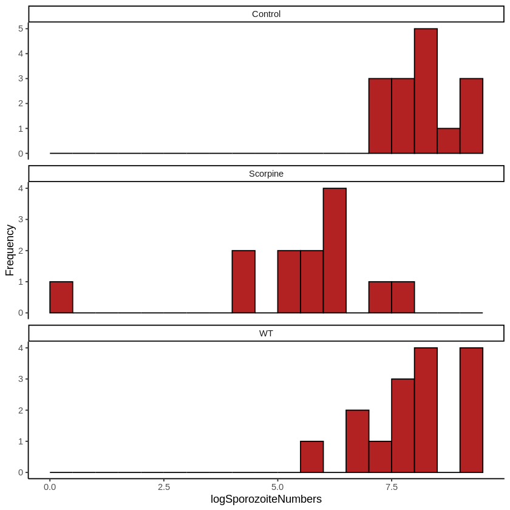

# Data Science Treatment Effect Modeling in Biological Systems

Experiment-style data science workflow for biological treatment-effect detection and interpretation.

## Overview

Compares biological treatment groups using analysis of variance and post-hoc testing. The notebook evaluates sex-ratio treatment effects on beetle offspring and explores mosquito malaria parasite data with grouped distribution plots.

The project is framed like a data science experiment analysis: define treatment groups, test whether group means differ, identify which groups drive the effect, and communicate the result with both statistical output and visualization.

## Tools and Methods

- R
- ANOVA
- Tukey HSD
- Faceted histograms
- Treatment-group comparison
- Experimental design
- Post-hoc pairwise comparison
- Distribution diagnostics
- Effect interpretation

## Key Work

- Tested whether sex-ratio treatment changed mean offspring counts.
- Used Tukey HSD to identify which treatment pairs differed.
- Visualized treatment-group distributions for malaria-related mosquito data.
- Treated biological treatment as the predictor and offspring/parasite measurements as response variables.
- Used post-hoc testing to move beyond “there is a difference” toward “which groups differ.”

## Data Science Framing

- **Problem type:** Multi-class group comparison and treatment-effect analysis.
- **Features:** Treatment group labels.
- **Response variables:** Total offspring and parasite-related measurements.
- **ML extension:** This could be extended into supervised prediction of response values using regression models, or into classification of treatment groups from measured biological outcomes.

## Dataset

Tribolium beetle and malaria fungus/venom datasets from Whitlock and Schluter textbook resources.

## Files

- `analysis.ipynb`: Main analysis notebook copied from the original Colab notebook.
- `assets/`: Extracted figures from the notebook for GitHub previews and README visuals.

## Resume Summary

Compared biological treatment groups using ANOVA, Tukey HSD, distribution diagnostics, and treatment-effect interpretation in R.
